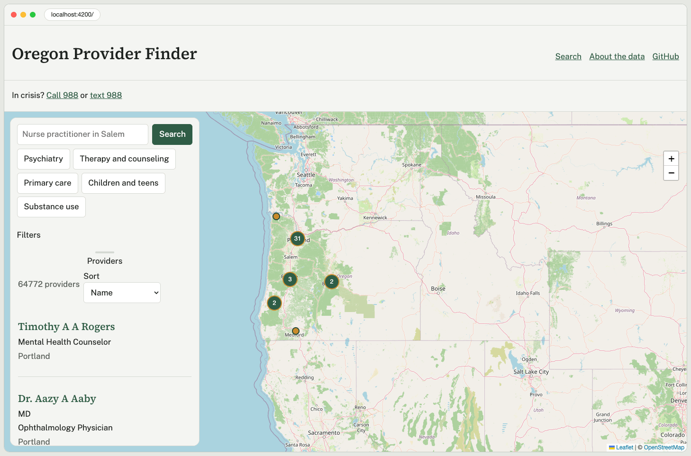
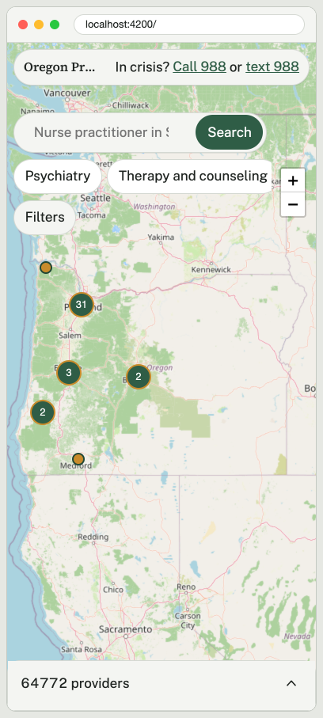
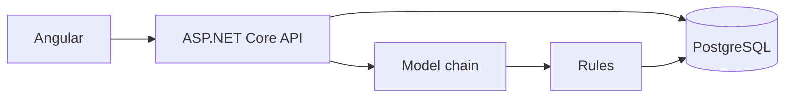

# Oregon Provider Finder

Search for licensed clinicians who practice in Oregon, using the federal NPI registry.






## Why I built this

I am a licensed counselor in Oregon. I had already built a statewide directory of providers in PHP, and the part I kept wanting was simpler than the product around it: who is practicing here, in this specialty, near this place. I rebuilt that core in C# and Angular, against the public NPI file, so the search and the data pipeline are easy to read.

## Features

- Seven clinician groups, from the NUCC taxonomy, limited to people with an Oregon practice address and an active NPI.
- City or ZIP search from Census ZIP centroids. Distance is in statute miles.
- Care-need presets, credential filters, and a sex filter. The sex field is self-reported.
- A full-screen map. The list follows the area in view, and a new search flies the map to the results.
- Search that tolerates a close misspelling of a name or city, and sorts by relevance when no place is set.
- Other practice locations from the NPPES location file, with the source and the data date on the profile.
- A map of result counts by ZIP.
- Plain-words search. The model proposes filters. The server checks them and drops anything the registry cannot answer, including insurance.
- A crisis line on every page: call or text 988.

## Tech stack

- .NET 10, ASP.NET Core, EF Core 10.0.4, Npgsql
- PostgreSQL 18
- Angular 22.2, standalone components, signals, zoneless
- Leaflet and OpenStreetMap tiles

## Quick start

You need the .NET 10 SDK, Node.js 22.22 or newer, and PostgreSQL 18 listening on localhost. Then:

```bash
./scripts/setup.sh
./scripts/dev.sh
```

The API is at <http://localhost:5080> and the app is at <http://localhost:4200>. If you do not already have Postgres, start the optional container, then point setup at it. It uses port 5432.

```bash
docker compose up -d
PGHOST=localhost PGUSER=postgres PGPASSWORD=postgres ./scripts/setup.sh
```

## Plain-words search

Without keys, a short list of rules reads the sentence. With free keys, the server tries Groq, then NVIDIA, then Cerebras, then Gemini, and stops at the first usable answer. A bad key or a timeout moves to the next one.

Add keys with user-secrets on both projects (`src/Api` and `src/Importer`):

```bash
dotnet user-secrets set "Llm:Groq:Keys:0" "your-key" --project src/Api
dotnet user-secrets set "Llm:Groq:Keys:0" "your-key" --project src/Importer
```

The same shape works for `Llm:Nvidia:Keys:0`, `Llm:Cerebras:Keys:0`, and `Llm:Gemini:Keys:0`. Keys stay on your machine. See `docs/ai-search.md` for the models that answered on 2026-09-27 and for how to get a key from each provider.

## Refreshing the data

The committed snapshot is the September 2026 NPPES dissemination, Oregon clinicians only, data as of 2026-09-13. To load a newer monthly file:

```bash
./scripts/refresh-data.sh --download-latest
./scripts/refresh-data.sh --export
```

`--export` writes `data/snapshot` again. The export exits non-zero if the snapshot passes 25 MB. Do not commit that snapshot.

## Architecture



More detail is in [docs/architecture.md](docs/architecture.md). Data notes are in [docs/data-sources.md](docs/data-sources.md), [docs/data-pipeline.md](docs/data-pipeline.md), and [docs/ai-search.md](docs/ai-search.md).

## Running tests

```bash
dotnet test
cd web && npm test && npm run e2e
```

The API tests use `oregon_providers_test` and do not call a model. GitHub Actions loads that database from the snapshot. See [docs/setup.md](docs/setup.md).

## Data sources and limits

Names, addresses, phones, and taxonomies come from the NPI registry and are self-reported. This is not a license check and it is not medical advice. Confirm details with the provider before booking. In crisis, call or text 988.

ZIP pins are the center of the ZIP, not the street address. The registry does not record insurance, languages, or whether someone is taking patients.

## Project structure

- `src/Core`: entities, the schema, the group list, the rules, and the model chain
- `src/Api`: HTTP, validation, rate limiting, OpenAPI
- `src/Importer`: full import, snapshot, ZIP centroids, taxonomy, and the probe
- `tests`: xUnit, including the API against the test database
- `web`: the Angular app
- `data/snapshot`: the committed Oregon extract
- `scripts`: setup, dev, refresh, and the secret scan
- `docs`: sources, pipeline, design, security

## How it was built

I built this with AI coding tools. The process is in [docs/decisions.md](docs/decisions.md): tests against the real snapshot, a review pass, and a security pass. Edit or cut this section if you want the README to stay quieter.

## License

The code is [MIT](LICENSE). The NPI registry is a US government work. The NUCC taxonomy subset is included under the terms noted in [docs/data-sources.md](docs/data-sources.md).

## Author

Eric Richers, <https://ulric.studio>
