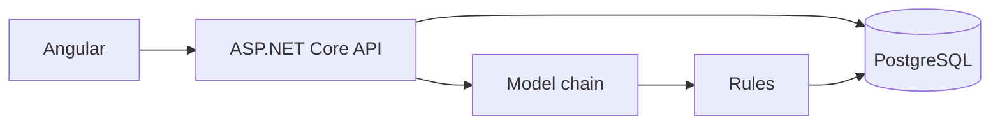

# Architecture

The browser talks only to the API. The API reads PostgreSQL as `opf_app`, which can select and cannot write. Imports and migrations use `opf_owner`.

A search reads the query string, checks it against the allowed groups, specialties, credentials, and places, then asks PostgreSQL. Distance uses `miles_between` after a bounding box. The map counts providers per ZIP. Those points are ZIP centers from the Census gazetteer, not street geocodes.

Plain-words search posts the sentence to `/api/search/interpret`. The server asks the model chain for a small JSON object, keeps the first answer that parses, and resolves every field against the database. A null radius is treated as omitted. If the chain returns nothing, the rules interpreter fills the same fields. The page shows what was understood and what the registry cannot filter, then navigates to that search.

`/api/meta` caches the import row and the provider count for 10 minutes and reads the chain status on each request. `/api/facets` is output-cached for 10 minutes. Interpret is limited to 20 requests a minute per IP.
